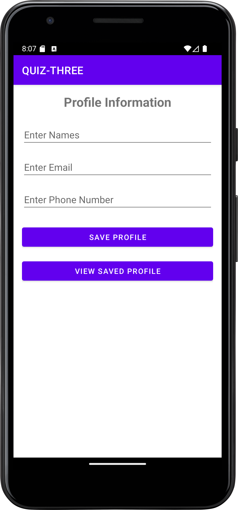

# QUIZ-THREE - Profile Management App

An Android application for managing user profiles with data persistence using SharedPreferences.

## Features

- Profile class with names, email, and phone number fields
- Two activities: ProfileActivity and DetailActivity
- Save profile data using SharedPreferences
- Display saved profile information
- Input validation (email format, empty fields)

## Project Structure

- **Profile.java** - Model class with getters and setters
- **ProfileActivity.java** - Input form with save functionality
- **DetailActivity.java** - Display saved profile data
- **SharedPreferences** - Data persistence implementation

## Screenshots

### Profile Input Screen


### Saved Data Display


## Technologies Used

- Java
- Android SDK (API 21-33)
- SharedPreferences
- Material Design Components

## Setup

1. Clone the repository:
```bash
git clone https://github.com/Pacifique16/Mobile-Quiz-III-Profile-Management-App.git
```

2. Open in Android Studio
3. Sync Gradle files
4. Run on emulator or device

## Requirements

- Android Studio
- Gradle 8.5+
- Java 21
- Android SDK 33

## ⭐ Show Your Support

**If you found this project helpful or interesting, please consider giving it a star!** 🌟

Your support motivates me to create more educational projects and helps others discover useful resources.


## 👨‍💻 Author
**Pacifique Harerimana**  
AUCA Student - Mobile Programming QUIZ-THREE

📧 Contact: [GitHub](https://github.com/Pacifique16)


##
*Built with ❤️ for learning and sharing knowledge*

